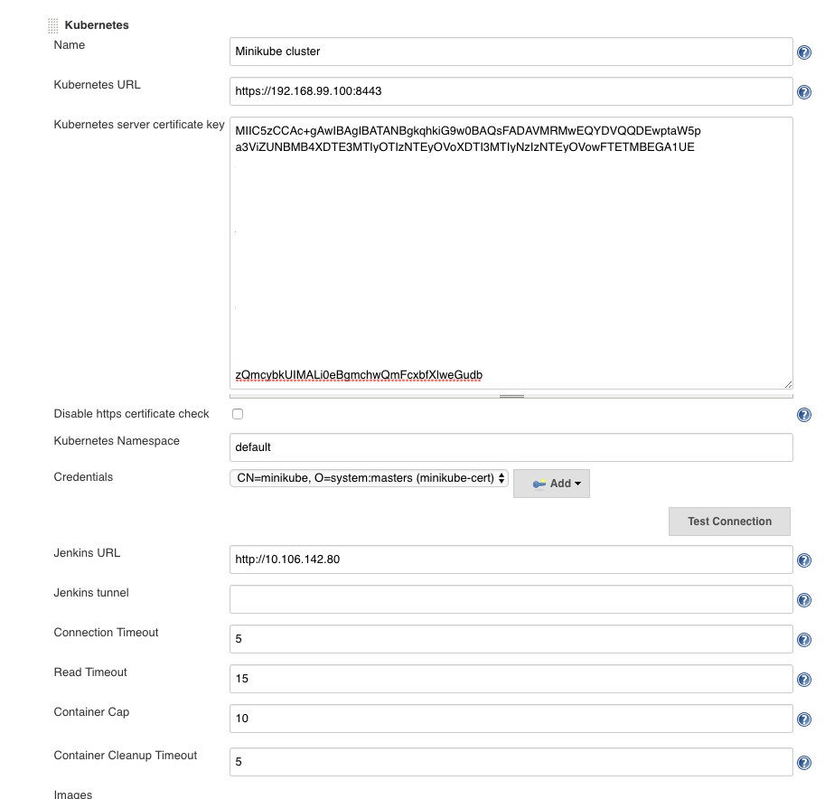
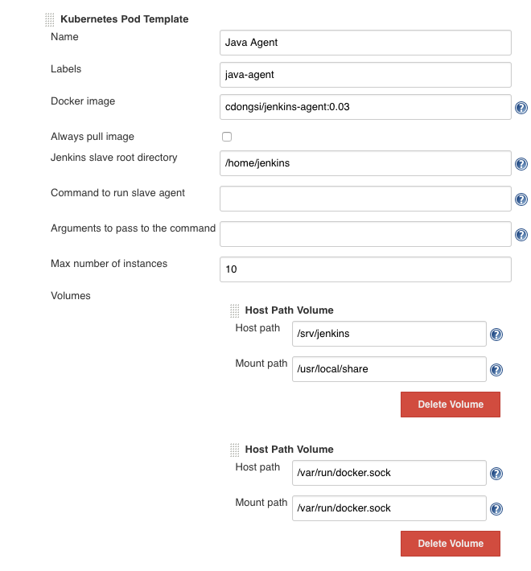

# Quick-start guide

Jenkins config as code for local development of Groovy-based Pipeline libraries.

### Steps to get started quickly

The following steps assume other one-time setups are already done.

* Install minikube.

#### Build the Docker images

Build the Docker images for Jenkins master and agents:

```text
docker build -t cdongsi/jenkins:0.09 .

cd agent
docker build -t cdongsi/jenkins-agent:0.03 .
```

#### Deploy Jenkins

Clean up persistent folders on Minikube VM.

```text
tdongsi$ minikube ssh
                         _             _
            _         _ ( )           ( )
  ___ ___  (_)  ___  (_)| |/')  _   _ | |_      __
/' _ ` _ `\| |/' _ `\| || , <  ( ) ( )| '_`\  /'__`\
| ( ) ( ) || || ( ) || || |\`\ | (_) || |_) )(  ___/
(_) (_) (_)(_)(_) (_)(_)(_) (_)`\___/'(_,__/'`\____)

$ sudo rm -rf /data/mydata/*
$ ls /data/mydata
$
```

Update `jenkins.yaml` with the right Docker image tag for Jenkins master.

```text
tdongsi-ltm4:jenkins-config tdongsi$ kubectl create -f k8s/jenkins.yaml
deployment "jenkins" created
service "jenkins" created

tdongsi-ltm4:jenkins-config tdongsi$ kubectl --namespace=sfdc get services
NAME      CLUSTER-IP       EXTERNAL-IP   PORT(S)                                        AGE
jenkins   10.104.225.173   <nodes>       80:30980/TCP,12222:30922/TCP,50000:30900/TCP   2m
```

#### Configure Jenkins

Wait for sometime for Jenkins to go up.
Log into Jenkins with username `user` and password `ranger1`.

Configure Kubernetes plugin with pre-installed credential "Minikube client certificate".



Configure Pod template with the *right Docker image tag* for Jenkins agent.



Configure "Global Pipeline Libraries" with Mock Steps Library. 

### References

